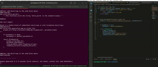

# Oasis
The idea is generate code with the assistance of guidance library, using open source LLM models that run locally.
This library is exposed as a VSCode plugin, and adds code-generation commands on editor selection (invoked through right-click or command palette).

NOTE: main is currently unstable, developing the use of guidance prompts (see guidance library: https://github.com/microsoft/guidance)

Version v0.1.4 will be released soon, which uses guidance with Salesforce Codegen models. This is still in development, highly experimental.

**WARNING**: Only add docstring to functions command is somewhat stable at the moment.

## If using v0.1.3
If you want to use text-generation-webui with simpler prompts, use v0.1.3. This is a deprecated feature, newer versions will no longer support `text-generation-webui`, at least for the time being.


1. Install text-generation-web-ui, start it with API: https://github.com/oobabooga/text-generation-webui

`git clone: https://github.com/paolorechia/oasis@v0.1.3`

2. Start the FastAPI server in `prompt_server`:
```
    cd prompt_server
    pip install -r requirements.txt
    ./start_uvicorn.sh
```

## If using v0.1.4 or main
### Installation

Main:
`git clone: https://github.com/paolorechia/oasis@main`

Or v0.1.4:

`git clone: https://github.com/paolorechia/oasis@v0.1.4`


1. Start the FastAPI server in `guidance_server`:
```
    cd guidance_server
    pip install -r requirements.txt
    ./start_uvicorn.sh
```
This server is quite heavy on dependencies, and expects that you can run PyTorch with GPU.


2. Start the FastAPI server in `prompt_server`:
```
    cd prompt_server
    pip install -r requirements.txt
    ./start_uvicorn.sh
```
3. Install VSCode plugin called 'oasis-llamas'
4. Use it!

### Local Codegen Models on VSCode
How does it work?

The Oasis backend receives a pair of command/selected code from the VSCode extension frontend, and uses this input to:

1. Parse the input code using the `ast` module (https://docs.python.org/3/library/ast.html)
2. Find specific code parts from the parsed code
3. Choose a guidance prompt to apply
4. Applies the guidance prompt, delegating the LLM call to the second backend service: `guidance server`
5. Parses the result and forms an adequate response back to the frontend.


### Changing Models
There is currently no exposed config. If you want to change the loaded model, change the source code in
`guidance_server/main.py`, in lines 35-39 you will find something like:

```python
# model = "TheBloke/wizardLM-7B-HF"
model = "Salesforce/codegen-350m-mono"
# model = "Salesforce/codegen-2b-mono"
# model = "Salesforce/codegen-6b-mono"
# model = "Salesforce/codegen-16B-mono"
```

Uncomment the one you'd like to use this with.

This plugin works even with the 350m-mono model version! That's currently only possible with something like the guidance library.
Although do expect better results with bigger models.

### Add docstrings to block of code


**Note:** for better results, select exactly ONE block of function to add docstring too, with NO syntax errors.


### Known issues

1. The plugin currently removes the extra new lines in the function definition. This is a problem related to the usage of the `ast.parse` function, which strips newlines. This is used to decompose the function header from the body, and inject the docstring generation.
2. The plugin sometimes messes up the indentation of the generated docstring/input code.
