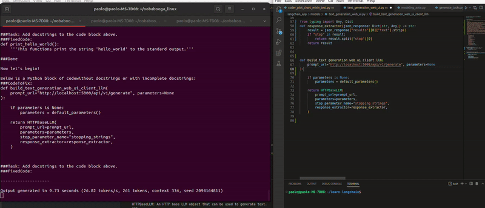

# Oasis

NOTE: main is currently unstable
Please use tag v0.1.3

## Local LLamas on VSCode
**WARNING**: does not yet work too well!

### Installation
1. Install text-generation-web-ui, start it with API: https://github.com/oobabooga/text-generation-webui
2. Start the FastAPI server in `prompt_server`:
```
    git clone: https://github.com/paolorechia/oasis@v0.1.3
    cd prompt_server
    pip install -r requirements.txt
    ./start_uvicorn.sh
```
3. Install VSCode plugin called 'oasis-llamas'
4. Use it!

This is still in development, highly experimental.

Change of plans: the idea is to roll not depend on text-generation-webui our own server with the guidance library.

Unfortunately, I'm a bit too low on time at the moment to do this properly, feel free to contribute with a PR if you'd like :)


### Add docstrings to block of code

